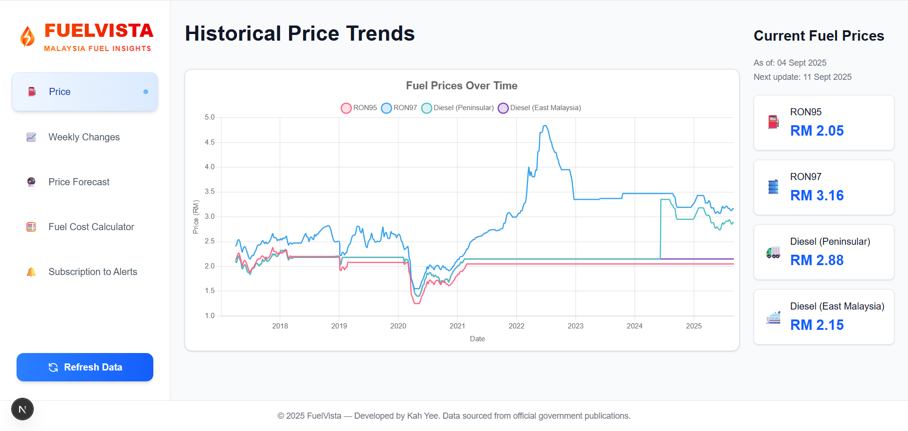
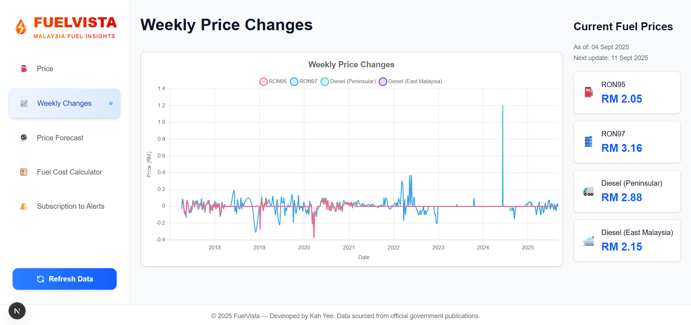
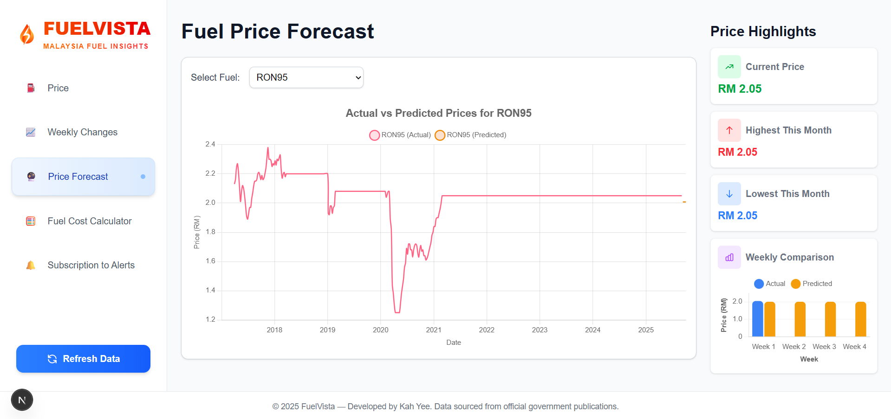
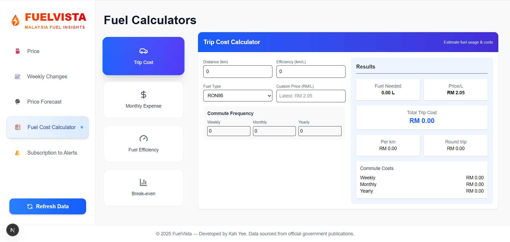
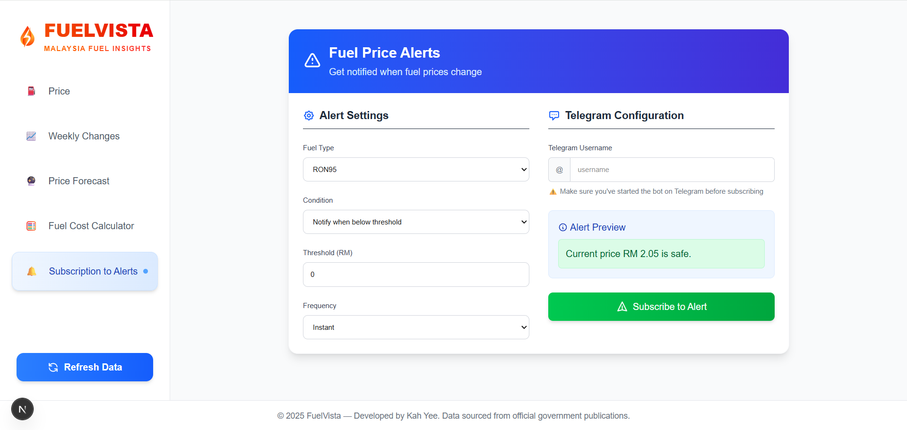

# FuelVista ⛽

  
  

**FuelVista** is a **single-page application (SPA)** and interactive dashboard for tracking fuel prices and trends in Malaysia. It provides real-time fuel prices, historical changes, AI-powered price forecasts, fuel cost calculations, and alert notifications—all without full-page reloads for a smooth user experience.

---

## 🌟 Features

- ⛽ **Current Fuel Prices**: View the latest RON95, RON97, and Diesel prices across Malaysia.  
- 📈 **Weekly Changes**: Track fuel price fluctuations week by week.  
- 🔮 **Price Forecast**: Predict fuel prices using TensorFlow-based models.  
- 🧮 **Fuel Cost Calculator**: Estimate travel costs based on fuel type, distance, and vehicle efficiency.  
- 🔔 **Alerts & Notifications**: Get real-time notifications via Telegram when fuel prices reach user-defined thresholds.  

---

## 📸 Dashboard Overview
Explore the intuitive and visually engaging interface of FuelVista. Each module is designed for clarity, interactivity, and seamless navigation, showcasing real-time insights and predictive analytics:

### Price Tab
View the latest RON95, RON97, and Diesel prices across Malaysia with a clean and responsive layout.

### Weekly Changes
Track weekly price fluctuations with interactive charts for quick, actionable insights.

### Price Forecast
Leverage AI-powered predictions to anticipate fuel price changes and plan efficiently.

### Fuel Calculator
Estimate travel costs with a sophisticated yet user-friendly calculator tailored to your vehicle and distance.

### Alert Subscription
Receive real-time notifications via Telegram, ensuring you never miss price changes that matter to you.

---

## 🛠 Tech Stack & Architecture

FuelVista uses a **modern full-stack architecture**:

### Frontend
- **Next.js** – React framework enabling SPA behavior for smooth navigation  
- **React** – Component-based UI  
- **Tailwind CSS** – Utility-first responsive styling  

### Backend
- **Node.js** – API endpoints and server logic  
- **Firebase** – Firestore database for storing user subscriptions, historical fuel data, and alerts  

### Machine Learning
- **TensorFlow** – AI-powered fuel price forecasts  
- Models are trained on historical fuel price data and served via backend APIs  

### Notifications
- **Telegram Bot** – Sends alerts when fuel prices meet user-defined thresholds  

### Data Flow
1. **Fuel Data** – Fetched from official sources and cached in Firebase  
2. **AI Forecast** – Backend predicts upcoming fuel prices  
3. **User Interaction** – SPA frontend displays real-time prices, forecasts, and calculators dynamically  
4. **Alerts** – Telegram bot triggers notifications for subscribed users  

---

## 🌱 Sustainable Development Goal

**SDG 9 – Industry, Innovation, and Infrastructure**  
FuelVista contributes to SDG 9 by leveraging **AI-powered forecasting**, real-time data dashboards, and a modern full-stack architecture to enhance **technological innovation** in fuel consumption tracking. By providing users with accurate insights, predictive analytics, and automated notifications, FuelVista supports **efficient infrastructure usage** and smarter transportation planning.
